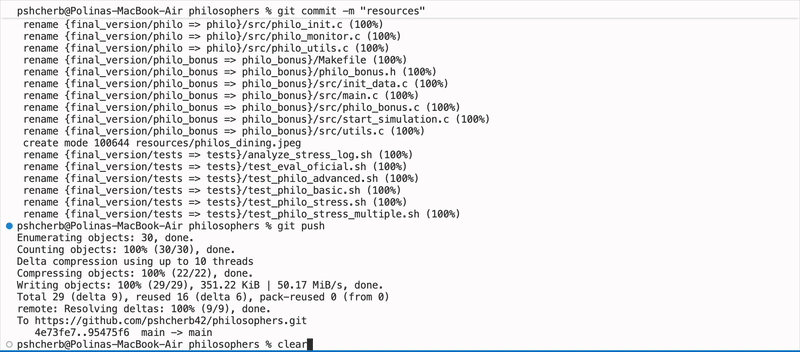

## Philosophers
## Project Overview

This project simulates the classic Dining Philosophers problem, focusing on concurrency, synchronization, and avoiding deadlocks. It consists of two parts:

**Mandatory part (philo):** Using threads and mutexes.

**Bonus part (philo_bonus):** Using processes and semaphores.
Both parts follow strict rules to ensure proper synchronization and timing.


## Features
## Mandatory Part (philo)

Each philosopher is implemented as a thread.
Forks are represented by mutexes, one between each philosopher.
Philosophers must correctly pick up and release forks to eat without causing deadlocks.
Timing constraints are strictly enforced: time to die, eat, sleep.
No global variables allowed.
Logs philosopher states with timestamps and philosopher numbers.
Clean error handling and resource management.

## Bonus Part (philo_bonus)

Each philosopher is a separate process.
Forks are managed by a semaphore counting available forks.
The main process creates philosopher processes but is not itself a philosopher.
Same timing and logging rules as the mandatory part.
Implements inter-process synchronization with semaphores.
## Getting Started
## Prerequisites

Unix-like operating system (Linux, macOS)
GCC compiler supporting pthreads and semaphores
Make utility
Installation & Build

Clone the repository:
``` bash
git clone https://github.com/yourusername/philosophers.git 
```
For the mandatory part:
``` bash
cd philosophers/philo make
```
For the bonus part:
``` bash 
cd ../philo_bonus make
```
## Usage
## Command-line Arguments



**Both programs accept the following arguments:**

number_of_philosophers time_to_die time_to_eat time_to_sleep [number_of_times_each_philosopher_must_eat

**number_of_philosophers:** Number of philosophers and forks.

**time_to_die (ms):** Time after which a philosopher dies if they don't start eating.

**time_to_eat (ms):** Time a philosopher spends eating.

**time_to_sleep (ms):** Time a philosopher spends sleeping.

**[optional] number_of_times_each_philosopher_must_eat:** Simulation ends when each philosopher has eaten this many times; otherwise, it ends when a philosopher dies.

## Running the Mandatory Part
````bash
./philo 5 800 200 200
````

**Example:** 5 philosophers, die after 800ms without eating, eat for 200ms, sleep for 200ms.


## Running the Bonus Part
````bash
./philo_bonus 5 800 200 200 7
````

**Example:** Same as above, but simulation ends after each philosopher has eaten at least 7 times.

## Logs Format
The program will output logs for philosopher states:
```
[timestamp_in_ms] X has taken a fork
[timestamp_in_ms] X is eating
[timestamp_in_ms] X is sleeping
[timestamp_in_ms] X is thinking
[timestamp_in_ms] X died
[timestamp_in_ms]: Current time in milliseconds since simulation start.
[X]: Philosopher number (1 to numberofphilosophers).
```
Logs must be clean and uninterrupted by other philosopher outputs.
Death logs must appear within 10ms of the philosopher's death.

## Project Structure
```
philo/         # Mandatory part source code
  ├── Makefile
  ├── *.c
  └── *.h

philo_bonus/    # Bonus part source code
  ├── Makefile
  ├── *.c
  └── *.h
  ```
## Contributing
Contributions and improvements are welcome! Please follow these steps:
```
Fork this repository.
Create your feature branch (git checkout -b feature-name).
Commit your changes (git commit -m 'Add some feature').
Push to the branch (git push origin feature-name).
Submit a pull request.
```
